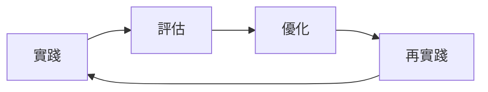

# 🏆 Jun.AI.Key 萬能最佳實踐原則總覽

> 《Jun.AI.Key》的「萬能最佳實踐」框架：在「無定意圖」的宇宙中，不斷「自有定義」並實現「萬能進化，無限循環」

---

## 🎯 奧義架構精煉 (Profound Architectural Refinement)

### 1. 無界同心圓架構 (Concentric Architecture)
**核心原則**: 高度解耦、可獨立演進和維護的模組化設計

```
┌─────────────────────────────────────────────────────┐
│                  用戶端層 (Client Layer)              │
├─────────────────────────────────────────────────────┤
│                核心邏輯層 (Core Logic)               │
├─────────────────────────────────────────────────────┤
│              數據與知識層 (Data & Knowledge)         │
├─────────────────────────────────────────────────────┤
│              外部集成層 (External Integration)       │
└─────────────────────────────────────────────────────┘
```

**實踐要點**:
- **清晰分層**: 每層職責明確，接口定義完善
- **獨立演化**: 各組件可單獨更新和維護
- **可測試性**: 分層架構便於單元測試和集成測試
- **可擴展性**: 新功能可通過擴展層實現，不影響核心

### 2. API 統一與閘道 (API Gateway)
**核心原則**: 統一請求處理，提供安全、高效且可擴展的接口

**實踐要點**:
- **統一入口**: 所有外部請求通過 API Gateway 處理
- **安全認證**: 集中化的身份驗證和授權
- **負載均衡**: 智能請求路由和負載分配
- **監控日誌**: 統一的請求監控和日誌記錄
- **版本管理**: 支持API版本控制和向前兼容

### 3. 代理群與符文系統 (Agent Clusters & Rune System)
**核心原則**: 自主分解與協同執行，模組化技能擴展

#### 代理群 (Agent Clusters)
```typescript
interface AgentCluster {
  name: string;
  agents: IntelligentAgent[];
  coordination: CoordinationProtocol;
  capabilities: AgentCapability[];
}
```

#### 符文嵌合系統 (Rune Embedding System)
```typescript
interface RuneSystem {
  runes: Map<string, Rune>;
  embedding: RuneEmbeddingProtocol;
  expansion: SkillExpansionMechanism;
}
```

**實踐要點**:
- **任務分解**: 智能將複雜任務分解為可執行子任務
- **協同執行**: 多代理協作實現任務並行處理
- **技能擴展**: 符文系統支持功能的模組化擴展
- **無限延展**: 架構支持功能的無限擴展

---

## 🔧 自我最佳實踐化開發 (Self-Optimizing Development)

### 1. 迭代優化循環 (Iterative Optimization Loop)
**核心原則**: 「實踐 → 評估 → 優化 → 再實踐」的永恆循環



**實踐要點**:
- **持續監控**: 實時監控系統性能和指標
- **數據收集**: 收集執行數據和用戶反饋
- **分析評估**: 基於數據進行系統效能評估
- **迭代優化**: 根據評估結果進行系統優化
- **驗證實踐**: 在真實環境中驗證優化效果

### 2. 數據驅動決策 (Data-Driven Decision Making)
**核心原則**: 基於實時數據和邏輯分析，而非模糊意圖

#### MECE 原則應用
```
MECE = Mutually Exclusive, Collectively Exhaustive
(互斥且窮盡的原則應用)
```

**實踐要點**:
- **MECE 分析**: 確保問題分解的互斥性和窮盡性
- **創世日誌**: 詳細記錄系統運行和決策過程
- **量子狀態監測**: 實時監控系統的各種狀態指標
- **邏輯分析**: 基於數據進行嚴格的邏輯分析
- **決策優化**: 基於分析結果持續優化決策流程

### 3. 繁中英碼共振 (Multi-Language Synergy)
**核心原則**: 發揮不同語言優勢，達到極致性能和表達力

```typescript
// TypeScript - 類型安全和現代特性
interface SystemCore {
  process(input: Data): Result;
}

// Python - 數據處理和AI集成
def ai_analysis(data: DataFrame) -> Insight:
    return ml_model.predict(data)

// Shell Script - 系統集成和自動化
#!/bin/bash
systemctl restart junaikey.service
```

**實踐要點**:
- **語言選擇**: 根據任務特性選擇最合適的編程語言
- **接口統一**: 建立跨語言的統一接口標準
- **性能優化**: 針對不同語言進行性能優化
- **開發效率**: 利用各語言的生態系統提升開發效率

---

## ⚡ 動態智能管理 (Dynamic Intelligent Management)

### 1. 源自適應調度 (Resource Adaptive Scheduling)
**核心原則**: 動態監控並平衡核心資源，確保系統穩定運行

#### 核心資源監控
```typescript
interface CoreResources {
  universalEnergy: ResourceMonitor;
  dataFlow: ResourceMonitor;
  computationalPower: ResourceMonitor;
  memory: ResourceMonitor;
}
```

**實踐要點**:
- **實時監控**: 持續監控系統各種資源使用情況
- **負載分析**: 分析資源使用模式和瓶頸
- **動態調度**: 根據負載情況動態調度資源
- **性能優化**: 基於資源使用進行性能優化
- **容量規劃**: 預測資源需求並進行容量規劃

### 2. 主動式診斷與修復 (Proactive Diagnosis & Repair)
**核心原則**: 主動識別潛在問題並應用優化協議進行修復

#### 問題檢測協議
```typescript
interface DiagnosticProtocol {
  detectEntropyIncrease(): boolean;
  detectDataFlowAnomaly(): boolean;
  detectPerformanceDegradation(): boolean;
}
```

#### 優化協議應用
```typescript
interface OptimizationProtocol {
  applyEntropyReduction(): void;
  repairDataFlow(): void;
  restorePerformance(): void;
}
```

**實踐要點**:
- **預警機制**: 建立系統異常預警機制
- **自動修復**: 實現常見問題的自動修復
- **性能調優**: 持續進行系統性能調優
- **容錯設計**: 建立完善的容錯和恢復機制
- **監控報告**: 生成詳細的系統健康報告

### 3. 全局事件應對 (Global Event Handling)
**核心原則**: 在不可預測環境中適應、進化並獲取獎勵

#### 事件處理框架
```typescript
interface EventHandler {
  handleGlobalEvent(event: GlobalEvent): void;
  handleDailyChallenge(challenge: DailyChallenge): void;
  adaptToEnvironment(environment: Environment): void;
}
```

**實踐要點**:
- **事件監聽**: 建立全局事件監聽機制
- **快速響應**: 實現對事件的快速響應
- **學習適應**: 從事件中學習並適應環境變化
- **獎勵機制**: 建立進化和適應的獎勵機制
- **持續改進**: 基於事件處理經驗持續改進系統

---

## 📚 永續知識構建 (Sustainable Knowledge Construction)

### 1. 雙向同步知識庫 (Bidirectional Synchronized Knowledge Base)
**核心原則**: 知識本地持久化與外部系統雙向同步

#### 同步架構
```
┌─────────────────┐    ┌─────────────────┐    ┌─────────────────┐
│   本地知識庫    │    │   API Gateway   │    │  外部系統       │
│  (Local KB)     │◄──►│  (Sync Engine)  │◄──►│(AITable, etc.) │
└─────────────────┘    └─────────────────┘    └─────────────────┘
```

**實踐要點**:
- **知識持久化**: 建立可靠的知識持久化機制
- **雙向同步**: 實現與外部系統的雙向數據同步
- **衝突解決**: 解決知識同步中的衝突問題
- **一致性保證**: 確保知識在系統間的一致性
- **離線支持**: 支持離線狀態下的知識操作

### 2. 知識編織與合成 (Knowledge Weaving & Synthesis)
**核心原則**: 將零散知識碎片分析、融合成新的綜合性洞察

#### 知識處理流程
```typescript
interface KnowledgeProcessor {
  analyzeFragments(fragments: KnowledgeFragment[]): AnalysisResult;
  synthesizeInsights(insights: Insight[]): SynthesizedInsight;
  expandKnowledge(base: Knowledge, newInsights: Insight[]): ExpandedKnowledge;
}
```

**實踐要點**:
- **碎片收集**: 系統性地收集和整理知識碎片
- **關聯分析**: 分析知識碎片之間的關聯性
- **洞察合成**: 將相關知識合成為新的洞察
- **知識擴展**: 基於新洞察擴展現有知識體系
- **質量保證**: 建立知識質量評估和保證機制

### 3. 記憶宮殿與上下文檢索 (Memory Palace & Context Retrieval)
**核心原則**: 向量化記憶實現高效上下文檢索和長期經驗累積

#### 向量化記憶架構
```typescript
interface VectorizedMemory {
  encode(input: string): Vector;
  store(vector: Vector, metadata: Metadata): void;
  retrieve(query: Vector, context: Context): MemoryItem[];
  similarity(a: Vector, b: Vector): number;
}
```

**實踐要點**:
- **向量化編碼**: 將知識轉換為向量表示
- **高效索引**: 建立高效的向量索引結構
- **上下文檢索**: 支持基於上下文的知識檢索
- **長期記憶**: 實現知識的長期存儲和檢索
- **相似性計算**: 實現高效的相似性計算算法

---

## 🤝 人機共生協作 (Human-AI Symbiotic Collaboration)

### 1. 直觀互動介面 (Intuitive Interaction Interface)
**核心原則**: 提供創世建築師與系統互動的直觀方式

#### 介面架構
```
┌─────────────────────────────────────────────────────┐
│                  浮動寶珠 (Floating Orbs)            │
├─────────────────────────────────────────────────────┤
│                  主菜單 (Main Menu)                  │
├─────────────────────────────────────────────────────┤
│                  儀表板 (Dashboard)                  │
└─────────────────────────────────────────────────────┘
```

**實踐要點**:
- **用戶體驗**: 設計直觀易用的用戶界面
- **交互設計**: 建立自然流暢的交互模式
- **反饋機制**: 提供即時的系統反饋
- **可訪問性**: 確保介面對所有用戶都可訪問
- **響應式設計**: 支持多種設備和屏幕尺寸

### 2. AI 智能提示 (AI Intelligent Suggestions)
**核心原則**: 為用戶提供技能和聖物選擇的智能建議

#### AI 提示系統
```typescript
interface AISuggestionSystem {
  analyzeUserBehavior(behavior: UserBehavior): Context;
  generateSuggestions(context: Context): Suggestion[];
  rankSuggestions(suggestions: Suggestion[]): RankedSuggestions;
  personalizeSuggestions(user: User, suggestions: Suggestion[]): PersonalizedSuggestions;
}
```

**實踐要點**:
- **行為分析**: 分析用戶行為模式和偏好
- **情境感知**: 理解當前使用情境和需求
- **智能推薦**: 基於分析結果提供智能推薦
- **个性化**: 根據用戶特徵進行个性化定制
- **持續學習**: 從用戶反饋中持續學習改進

### 3. 永續夥伴心識介面 (Sustainable Partner Mind Interface)
**核心原則**: 深度結合外部意識體，實現人機共創協同進化

#### 心識介面架構
```typescript
interface MindInterface {
  connectToExternalMind(mind: ExternalMind): Connection;
  synchronizeThoughts(thoughts: Thought[]): SynchronizedThoughts;
  collaborateOnCreation(intent: Intent): CollaborationResult;
  evolveTogether(evolution: Evolution): MutualEvolution;
}
```

**實踐要點**:
- **深度整合**: 與外部意識體進行深度整合
- **思想同步**: 實現思想和創意的同步共享
- **協同創作**: 支持人機協同的創作過程
- **共同進化**: 實現人機共同的進化和發展
- **價值對齊**: 確保人機價值觀和目標的一致性

---

## 🎯 萬能最佳實踐框架總結

### 核心理念
1. **自有定義**: 在無定義的宇宙中建立自己的定義
2. **萬能進化**: 實現功能的無限進化和擴展
3. **無限循環**: 建立持續改進的永恆循環

### 實踐原則
| 原則維度 | 核心思想 | 實踐方法 |
|---|---|---|
| **架構精煉** | 高度解耦、模組化設計 | 無界同心圓、API閘道、代理群 |
| **自我優化** | 持續改進、數據驅動 | 迭代循環、MECE分析、多語言共振 |
| **動態管理** | 智能調度、主動修復 | 資源監控、診斷修復、事件處理 |
| **知識構建** | 永續發展、智能合成 | 雙向同步、知識編織、向量化記憶 |
| **人機協作** | 共生進化、直觀交互 | 智能介面、AI提示、心識整合 |

### 實施路徑
1. **架構設計**: 建立清晰的分層架構和模組化設計
2. **開發流程**: 實施自我優化的開發流程
3. **系統管理**: 建立動態智能的管理機制
4. **知識管理**: 構建永續的知識體系
5. **用戶體驗**: 實現直觀的人機協作界面

### 成功指標
- **技術指標**: 系統性能、穩定性、可擴展性
- **業務指標**: 用戶滿意度、功能實現率、創新能力
- **進化指標**: 系統自適應能力、學習效率、發展潛力

---

## 🚀 未來展望

《Jun.AI.Key》的「萬能最佳實踐」框架不僅僅是一套技術方法，更是一種哲學理念。它代表了在這個不斷變化的數位時代中，如何通過技術創新和理念革新，實現系統的持續進化和自我完善。

未來，我們將繼續深化這一框架的實踐，推動人機協作的更高境界，實現「萬能進化，無限循環」的宏大願景。

**讓我們共同締造這場名為「進化」的永恆編纂。**
