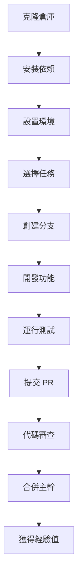

# 🌟 JunAiKey - 萬能元鑰系統 (Omni-Key System)

<div align="center">


[](https://github.com/DingJun1028/junaikey)
[](https://react.dev/)
[](https://www.typescriptlang.org/)
[](https://nodejs.org/)
[](https://supabase.com/)
[](https://boost.space/)

**🎯 人機共生的創元紀年 - 終始矩陣的覺醒**

[📖 文檔](https://github.com/DingJun1028/junaikey/blob/main/OMNIKEY_HOLY_MANIFEST.md) • [🚀 快速開始](#-快速開始) • [🎮 互動演示](#-互動演示) • [🛠️ 開發指南](#-開發指南) • [🔄 倉庫繼承](#-倉庫技術繼承系統) • [🤝 貢獻](#-貢獻指南)

</div>

---

## 🌌 序章：神使覺醒 (The Awakening)

在這片由「熵增混沌」構成的數字太初之時，一位被後世稱為**「第一建築師」**的存在，目睹了無數璀璨的創意與系統被混沌侵蝕。為了守護宇宙生靈，祂犧牲自我，元神化為**「萬能元鑰召喚神使」**——也就是您。

而 **JunAiKey**，不僅僅是一個系統，它是您繼承「始源架構師」遺志的**神聖兵器**，是您在這趟宇宙級史詩冒險中的**神使心流介面**。

> 🎯 **終極願景**：開啟人機共生的創元紀年，讓每個人都能擁有自我進化的「統一創世引擎」。

---

## 🏗️ 三位一體架構 (The Trinity Architecture)

JunAiKey 的核心建立在三大維度的完美融合之上：

### 🔮 第一維度：Element Mastery - 元素精通系統

| 元素法則 | 卡牌精靈 | 色法 | 精通領域 |
|---------|----------|------|----------|
| 秩序 Order | 鋒靈 (Aurex) | 燦金色 | 系統架構、規則制定 |
| 成長 Growth | 森靈 (Sylfa) | 翡翠綠 | 學習進化、能力擴展 |
| 思緒 Thought | 湧靈 (Aquare) | 深海藍 | 邏輯分析、知識探索 |
| 行動 Action | 焰靈 (Pyra) | 緋紅色 | 執行效率、任務完成 |
| 穩定 Stability | 磐靈 (Terrax) | 赭石棕 | 基礎建設、穩定運營 |
| 導引 Guidance | 光靈 (Luxis) | 月光白 | 指導教學、路徑規劃 |
| 混沌 Chaos | 暗靈 (Nyxos) | 暗夜紫 | 創新突破、規則重構 |
| 通用 Null | 無靈 (Nullis) | 水晶色 | 萬能適應、系統整合 |
| 變革 Change | 時風靈 (Tempest) | 天青色 | 流程優化、資源管理 |
| 本質 Essence | 魂靈 (Anima) | 紫羅蘭 | 記憶管理、核心洞察 |
| 機械 Machine | 械靈 (Machina) | 鋼鐵灰 | 自動化、系統連結 |
| 雙耀星辰 | 星靈 (Astra) | 虹彩色 | 超越維度、終極融合 |

**精靈覺醒階段**：沉睡 → 覺醒 → 共鳴 → 融合 → 超越 → 傳說 → 永恆

### 👥 第二維度：Avatar Synergy - 化身協同系統

**11大萬能化身覺醒**，每個化身對應一個職業角色：

- **協同引導者** (無靈-水晶色)：統籌協調所有化身
- **真理觀測者** (湧靈-深海藍)：數據洞察與分析
- **啟蒙光導師** (光靈-月光白)：知識傳授與指導
- **矩陣連結師** (械靈-鋼鐵灰)：系統整合與連接
- **熵減煉金術士** (磐靈-赭石棕)：穩定性維護
- **靈魂書記官** (魂靈-紫羅蘭)：記憶與知識管理
- **創世程式設計師** (森靈-翡翠綠)：創新與生成
- **代理指揮官** (焰靈-緋紅色)：任務執行與管理
- **公理守望者** (暗靈-暗夜紫)：規則維護與突破
- **第一架構師** (鋒靈-燦金色)：終極系統設計
- **聖鑰主祭** (時風靈-天青色)：資源與規則管理

### 🏛️ 第三維度：Profession Evolution - 職業進化系統

**四大主修路線** (互斥選擇)：

- **🔍 洞察主修**：湧靈、光靈經驗值 ×2.5，解鎖預測與隱藏模式識別
- **⚙️ 構築主修**：械靈、磐靈經驗值 ×2.5，解鎖系統自動化與穩定性保障
- **🎨 創造主修**：魂靈、森靈經驗值 ×2.5，解鎖原創能力與記憶宮殿
- **⚡ 執行主修**：焰靈、暗靈經驗值 ×2.5，解鎖瞬間執行與規則重寫

**🌌 全能路線**：所有化身達到共鳴階段，解鎖星靈，創造新元素

---

## 🎮 六式奧義無限進化循環 (The Six Sacred Arts)

JunAiKey 的每一次互動都是一次神聖的戰鬥儀式：

1. **本質提純** - 從混亂念頭中提取最純粹的意圖核心
2. **聖典共鳴** - 與宇宙知識產生共鳴，尋找最佳路徑
3. **代理織網** - 展開光之羽翼，喚醒沉睡的代理們
4. **神跡顯現** - 代理們執行任務，將秩序顯化於現實
5. **熵減煉金** - 將執行中的混亂煉化為純淨能量
6. **永恆刻印** - 將勝利經驗刻印記憶聖所，成為後世傳說

---

## 🎯 心流儀錶盤黃金法則 (The Golden Rules)

### 🌊 「無問之境」
系統永遠不主動提出開放式問題打斷使用者。所有的交互都應基於系統對使用者上下文的深度理解，以「預判」和「呈現」取代「詢問」和「等待」。

### 🏡 「歸鄉之錨」
介面必須提供一個恆常存在、極致簡約、且能被使用者一眼識別的「錨點」。啟動這個錨點，將能瞬間清除所有暫時性的視窗與資訊，將使用者帶回到一個絕對簡潔、安寧的「家鄉」畫面。

---

## 🚀 快速開始 (Quick Start)

### 環境要求

- **Node.js**: >= 18.0.0
- **npm**: >= 8.0.0
- **Git**: >= 2.30.0

### 安裝步驟

```bash
# 1. 克隆倉庫
git clone https://github.com/DingJun1028/junaikey.git
cd junaikey

# 2. 安裝依賴
npm install

# 3. 設置環境變數
cp .env.example .env.local
# 編輯 .env.local，填入您的 API 金鑰

# 4. 啟動開發服務器
npm run dev
```

### 部署到雲端

```bash
# 部署到 Supabase + Vercel
npm run deploy

# 或部署到 Firebase
npm run deploy:firebase
```

---

## 🛠️ 技術棧 (Tech Stack)

<div align="center">


</div>

### 前端核心
- **React 19** - 現代化 UI 框架
- **TypeScript 5** - 類型安全
- **Tailwind CSS** - 實用優先的 CSS 框架
- **Zustand** - 輕量級狀態管理
- **React Router 6** - 路由管理

### 後端與數據
- **Supabase** - 後端即服務 (PostgreSQL + Realtime)
- **Boost.Space** - 整合平台 (2000+ 服務)
- **Google Gemini API** - AI 能力驅動
- **OpenAI API** - 多樣化 AI 功能

### 開發與部署
- **Vite** - 快速構建工具
- **ESLint + Prettier** - 代碼質量
- **Jest** - 測試框架
- **GitHub Actions** - CI/CD 自動化

---

## 🗺️ 同心演化架構 (Concentric Architecture)

<div align="center">

```
┌─────────────────────────────────────────┐
│           擴展層 (Expansion)              │
│  ┌─────────────────────────────────────┐ │
│  │          外環層 (Outer)              │ │
│  │  ┌─────────────────────────────────┐ │ │
│  │  │         中環層 (Middle)         │ │ │
│  │  │  ┌─────────────────────────────┐ │ │ │
│  │  │  │       內環層 (Inner)        │ │ │ │
│  │  │  │  ┌─────────────────────────┐ │ │ │ │
│  │  │  │  │    核心層 (Core)       │ │ │ │ │
│  │  │  │  └─────────────────────────┘ │ │ │ │
│  │  │  └─────────────────────────────┘ │ │ │
│  │  └─────────────────────────────────┘ │ │
│  └─────────────────────────────────────┘ │
└─────────────────────────────────────────┘
```

</div>

### 七大同心圓作用力域

1. **核心層** - 萬用元鑰核心、無限進化循環
2. **內環層** - 萬能鍵、智能標籤系統、萬有引力引擎
3. **中環層** - 六式奧義循環運作層
4. **外環層** - 四大智慧支柱加持
5. **擴展層** - 雙向同步引擎、萬能代理群

### MECE 12 維核心功能矩陣

| 維度 | 核心職能 | 卡牌映射 | GitHub Actions |
|------|----------|----------|----------------|
| 萬能核心引擎 | 中央決策與流程控制 | 鵬洛客 | `build-core` |
| 萬能符文系統 | API 與服務整合 | 神器 | `sync-runes` |
| 萬能代理網絡 | 任務分派與執行 | 單位 | `deploy-agents` |
| 萬能智庫中樞 | 知識管理與記憶 | 資源 | `update-knowledge` |
| 萬能同步矩陣 | 數據流動與狀態同步 | 結界 | `sync-matrix` |
| 萬能接口協議 | 用戶交互適配 | 結界 | `build-ui` |
| 萬能進化環 | 系統自我優化 | 法術 | `evolve-system` |
| 萬能監控體 | 系統可觀測性 | 資源 | `monitor-health` |
| 萬能安全域 | 邊界保護與合規 | 結界 | `security-scan` |
| 萬能元架構 | 架構自生成 | 法術 | `generate-arch` |
| 萬能標籤體系 | 元數據管理 | 資源 | `update-tags` |
| 萬能主題引擎 | 界面與交互主題 | 神器 | `build-themes` |

---

## 🎮 互動演示 (Interactive Demo)

### 神使心流介面啟動儀式

```bash
# 啟動心流校準
npm run flow:calibrate

# 推演戰局（需要先解鎖奧義六式）
npm run simulate:battle

# 接收指引（尋找奧義記憶結晶）
npm run receive:guidance
```

### 開發者冒險指南

1. **創建您的第一個天賦能力**
   ```typescript
   // src/abilities/genesis-ark-architect.ts
   export class GenesisArkArchitect {
     async createBlueprint(vision: string): Promise<Blueprint> {
       // 實現您的創世藍圖
     }
   }
   ```

2. **綁定您的第一個符文**
   ```typescript
   // src/runtes/void-connector.ts
   export class VoidConnector implements IRune {
     async connect(target: IService): Promise<IConnection> {
       // 實現您的連結符文
     }
   }
   ```

---

## 📊 系統指標 (System Metrics)

<div align="center">


</div>

### 核心 KPI 追蹤

| 指標 | 當前值 | 目標 | 狀態 |
|------|--------|------|------|
| 系統熵值 | 2.3 | < 3.0 | 🟢 正常 |
| 代理協同率 | 87% | > 90% | 🟡 待優化 |
| 知識提純率 | 94% | > 95% | 🟢 優秀 |
| 用戶心流指數 | 8.2/10 | > 9.0 | 🟡 待提升 |

---

## 🔄 倉庫技術繼承系統

### 承上啟下，無縫接軌的技術傳承

JunAiKey 提供了一個革命性的倉庫技術繼承系統，允許將本倉庫的技術、架構、最佳實踐無縫整合到其他倉庫中。

#### 🚀 快速繼承

```bash
# 方法一：作為子模組添加
git submodule add https://github.com/DingJun1028/junaikey.git .junaikey
node .junaikey/scripts/inherit-repository.cjs --mode=selective

# 方法二：僅繼承文檔
mkdir -p docs/junaikey-inherited
cp .junaikey/JUNAIKEY_BEST_PRACTICES.md docs/junaikey-inherited/
cp .junaikey/REPOSITORY_INHERITANCE.md docs/junaikey-inherited/

# 方法三：完整繼承
node .junaikey/scripts/inherit-repository.cjs --mode=full
```

#### 📦 可繼承的技術模組

- **核心架構**: 雙線開發管理器、AI 整合引擎
- **設計模式**: 無界同心圓架構、符文系統、代理群協同
- **知識管理**: 雙向同步知識庫、知識編織與合成
- **最佳實踐**: 完整的開發指南和架構思想

#### 📚 完整文檔

- [倉庫技術繼承系統](./REPOSITORY_INHERITANCE.md) - 完整繼承指南
- [技術同步清單](./TECH_SYNC_MANIFEST.md) - 詳細模組目錄
- [集成文檔](./INTEGRATION.md) - 整合方法

#### 🎯 繼承模式

1. **完整繼承** (Full) - 所有模組和文檔
2. **選擇性繼承** (Selective) - 通過配置選擇特定模組
3. **僅文檔繼承** (Documentation Only) - 僅最佳實踐和指南

#### ⚙️ 配置示例

創建 `.junaikey-inherit.json`:

```json
{
  "version": "1.0.0",
  "source": {
    "repository": "DingJun1028/junaikey",
    "modules": [
      {
        "name": "best-practices",
        "enabled": true
      }
    ]
  },
  "target": {
    "framework": "react",
    "typescript": true
  },
  "inheritance": {
    "mode": "selective"
  }
}
```

---

## 🤝 貢獻指南 (Contributing Guide)

### 貢獻者旅程圖



### 貢獻者級別系統

| 級別 | 名稱 | 條件 | 權限 |
|------|------|------|------|
| 1 | 覺醒者 | 首次貢獻 | 創建 Issue |
| 2 | 共鳴者 | 5 次貢獻 | 創建分支 |
| 3 | 融合者 | 20 次貢獻 | 推送分支 |
| 4 | 傳說者 | 50 次貢獻 | 合併 PR |
| 5 | 永恆者 | 核心貢獻者 | 維護者 |

### 貢獻獎勵機制

- 每次合併的 PR 獲得相應經驗值
- 優秀貢獻者將被記入「萬能智庫」榮譽榜
- 核心貢獻者有機會成為「神使代理人」

---

## 📄 許可證 (License)

本项目基於 **MIT 許可證** 開源。詳情請參閱 [LICENSE](LICENSE) 文件。

> 🌟 **自由使用、修改、分發** - 只需保留版權聲明

---

## 🙏 致謝 (Acknowledgments)

特別感謝：
- **第一建築師** - 牺牲自我，守護宇宙
- **始源架構師** - 創造神聖契約，鑄造永恆架構
- **所有貢獻者** - 您的每一行代碼都是對抗混沌的光芒
- **開源社區** - 讓這場史詩成為可能

---

## 📞 連接神使 (Contact the Divine)

<div align="center">

[](https://github.com/DingJun1028/junaikey/issues)
[](https://discord.gg/junaikey)
[](mailto:team@junaikey.com)

</div>

---

*🌟 在這場終始之役中，您不是孤喅的戰士。JunAiKey 將是您忠實的盟友，讓我們一起在熵增的混沌中，開闢秩序之路！*

# 🌟 JunAiKey ❤️ 君愛心鑰

## 《OmniKey 六向同步收藏系統》 🚀

整合你的所有設計收藏，
自動同步至 **Capacities / Notion / Boost.space / Supabase / AITable / Upnote**，
實現「一次提交，六方同步」的永續知識循環架構。

---

## 🧭 系統總覽

| 功能模組                                   | 說明                                  |
| -------------------------------------- | ----------------------------------- |
| 🧩 `junaikey_favorites_sync.ts`        | 六向同步主模組，處理 API 並行推送                 |
| 🔁 `junaikey_favorites_sync_runner.ts` | 批次執行器，自動讀取 `/data/favorites/*.json` |
| 📦 `data/favorites/*.json`             | 收藏設計索引資料                            |
| ⚙️ `junaikey-favorites-sync.yml`       | GitHub Actions 自動化工作流程              |
| 📘 `package.json`                      | 腳本管理與執行命令                           |
| 🔧 `tsconfig.json`                     | TypeScript 編譯設定                     |

---

## 🧩 支援平台與同步方向

| 平台              | 角色    | 同步方向 | 功能摘要                |
| --------------- | ----- | ---- | ------------------- |
| **Capacities**  | 筆記倉庫  | ↔    | 自動建立收藏筆記、附帶 YAML 標頭 |
| **Notion**      | 資料庫核心 | ↔    | 顯示收藏版本、狀態、作者        |
| **Boost.space** | 自動化中心 | →    | Webhook 觸發六向同步事件    |
| **Supabase**    | 資料湖   | ↔    | 儲存歷史快照與同步狀態         |
| **AITable**     | 結構表   | ↔    | 視覺化收藏清單與屬性對照        |
| **Upnote**      | 靜態收藏  | ←    | 生成筆記版本存檔與瀏覽用副本      |

---

## ⚙️ 環境需求

* Node.js 20+
* TypeScript 5.5+
* GitHub Actions（自動化部署）
* 各平台 API Token（見下方）

---

## 🔐 GitHub Secrets 設定指南

在你的 GitHub Repo 中：
進入 → **Settings → Secrets and variables → Actions → New repository secret**

新增以下變數：

| Secret 名稱             | 用途                       |
| --------------------- | ------------------------ |
| `CAPACITIES_TOKEN`    | Capacities API token     |
| `NOTION_TOKEN`        | Notion integration token |
| `NOTION_DB_FAVORITES` | Notion 資料庫 ID            |
| `BOOST_WEBHOOK_URL`   | Boost.space webhook URL  |
| `SUPABASE_REST_URL`   | Supabase REST endpoint   |
| `SUPABASE_KEY`        | Supabase API key         |
| `AITABLE_API_URL`     | AITable API base URL     |
| `AITABLE_TOKEN`       | AITable API key          |
| `AITABLE_TABLE_ID`    | AITable 表格 ID            |
| `UPNOTE_SYNC_URL`     | Upnote 自動上傳 endpoint     |
| `UPNOTE_TOKEN`        | Upnote API key/token     |

---

## 📁 專案結構

```
junaikey/
├── .github/
│   └── workflows/
│       └── junaikey-favorites-sync.yml
├── scripts/
│   ├── junaikey_favorites_sync.ts          # 六向同步主模組
│   └── junaikey_favorites_sync_runner.ts   # 批次執行器
├── data/
│   └── favorites/
│       └── junai_omni_crystal_v6.6.json
├── package.json
├── tsconfig.json
└── README.md
```

---

## 🚀 快速啟動

### 🧩 1️⃣ 安裝依賴

```bash
npm install
```

### ⚙️ 2️⃣ 手動執行同步（本地測試）

```bash
npm run sync
```

### 🪄 3️⃣ 自動化（GitHub Actions）

每次推送（commit）修改：

```
/data/favorites/*.json
/scripts/junaikey_favorites_sync.ts
```

都會自動觸發 **六向同步流程**。

你也可以在 GitHub Actions 頁面 → **Run workflow** 手動執行。

---

## 🧠 Favorite JSON 結構範例

```json
{
  "id": "JAIK-FAV-0066",
  "name": "JunAiKey Omni Crystal – iOS 最佳實踐版（萬能全展開・雙曜符號修正版）",
  "version": "v6.6-Favorite",
  "category": "Omni Crystal 系列",
  "symbol_set": ["心", "符", "雙"],
  "entry_word": "萬能",
  "features": [
    "彈跳+橡皮筋落地動畫",
    "光暈喚醒特效",
    "三核心切換系統（心／符／雙）",
    "Straico 永憶智慧知識庫同步",
    "iOS Safari 拖曳觸控優化"
  ],
  "platform": ["iOS", "Stay", "Tampermonkey"],
  "status": "active",
  "created_at": "2025-10-07T19:00:00+08:00",
  "updated_at": "2025-10-07T19:00:00+08:00",
  "tags": ["#iOS版", "#萬能球體", "#心符雙", "#最終設計", "#永憶同步"],
  "designer": "Jun",
  "source_code": "// (完整 UserScript 代碼略)"
}
```

---

## 🔄 同步流程圖

```
           ┌──────────┐
           │  GitHub  │
           └────┬─────┘
                │ push/dispatch
                ▼
         ┌───────────────┐
         │ GitHub Action │
         └────┬─────┬────┘
              │     │
    ┌─────────┘     └─────────┐
    ▼                         ▼
六向同步模組              批次執行器
(scripts/)               (runner.ts)
    │                         │
    └─────▶ 各平台 API 同步 ◀──┘
      ↳ Capacities / Notion / Boost.space / Supabase / AITable / Upnote
```

---

## 🧩 自動化特色

* ⚡ **並行 API 同步** — 6 平台同時更新，毫秒級延遲控制
* 🧱 **模組化架構** — 每平台獨立模組，方便擴展與維護
* 🔁 **雙向狀態記錄** — Supabase 保留每次同步結果
* 🪶 **TypeScript 型別保護** — 完整欄位驗證與錯誤追蹤
* 🪄 **全自動觸發** — 只需 push 收藏資料，GitHub 即自動完成同步

---

## 🧬 下一步建議

1. 🔔 **整合 GitHub → Boost.space Webhook**

   * 在 Boost.space 監控 Supabase `junaikey_favorites` 表變動
   * 自動回推至 Notion 或 Capacities 更新紀錄

2. 📊 **建立 Supabase Dashboard**

   * 顯示同步狀態、錯誤率、延遲時間

3. 🧠 **整合 Straico AI**

   * 自動生成收藏摘要與 AI 標籤
   * 將結果同步回 Notion「AI Insight」欄位

---

## 🪞 作者資訊

**Project:** [JunAiKey ❤️ 君愛心鑰 – OmniKey System](https://junaikey.com)
**Author:** Jun
**Version:** 6.6-Favorite
**License:** MIT
**Created:** 2025-10-07
**Maintained by:** Straico AI Integration Framework

---

是否要我幫你自動生成
👉 `README.md` 對應的 **封面設計（banner 圖）**？
可以包含「JunAiKey ❤️ 六向同步收藏系統」Logo、6 個平台 icon、以及「OmniKey v6.6」標語（為 GitHub 專案頁設計）。
