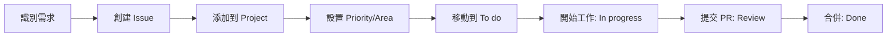

# 📊 GitHub Projects (beta) 文檔索引

歡迎來到 JunAiKey 專案的 GitHub Projects (beta) 管理文檔中心。

## 📚 文檔導航

### 🎯 快速開始

- **[快速參考指南](./PROJECTS_QUICKREF.md)** ⭐ 推薦
  - 常用操作速查
  - 快捷鍵參考
  - 最佳實踐建議
  - 故障排除

### 📖 完整文檔

- **[完整使用說明](../PROJECTS_BETA_INSTRUCTIONS.md)**
  - GitHub Projects (beta) 完整介紹
  - 詳細設置步驟
  - GraphQL API 範例
  - 自動化腳本

- **[專案模板](./PROJECTS_BETA_TEMPLATE.md)**
  - 預定義的專案結構
  - 欄位設定建議
  - 初始工作項目列表

## 🛠️ 工具與腳本

### 管理腳本

位置: `scripts/projects-manager.sh`

**功能特性:**
- ✅ 列出所有專案
- ✅ 查看專案詳情
- ✅ 創建新專案
- ✅ 添加項目到專案
- ✅ 更新項目狀態
- ✅ 導出專案資料

**快速使用:**

```bash
# 設置 GitHub Token
export GITHUB_TOKEN="your_personal_access_token"

# 列出所有專案
./scripts/projects-manager.sh list

# 查看專案詳情
./scripts/projects-manager.sh info 1

# 查看完整幫助
./scripts/projects-manager.sh help
```

## 🚀 快速操作指南

### 第一次使用

1. **啟用 Projects 功能**
   ```
   Settings → Features → 勾選 Projects
   ```

2. **創建新專案**
   ```
   Projects → New project → New project (beta)
   ```

3. **設置欄位**
   - Status (必備)
   - Priority (必備)
   - Area (建議)
   - Estimate (建議)
   - Assignee (建議)

4. **創建視圖**
   - Board by Status (主視圖)
   - Table all fields (詳細視圖)
   - Roadmap (規劃視圖)

### 日常工作流程

```
📝 早上
├─ 檢視 Board by Status
├─ 更新 "In progress" 項目
└─ 從 "To do" 選擇新任務

⚡ 工作中
├─ 移動項目到 "In progress"
├─ 指派給自己
└─ 及時更新進度

✅ 完成後
├─ 移動到 "Review"
├─ 關聯 Pull Request
└─ 審查通過後標記 "Done"
```

## 📊 建議的專案結構

### Documentation Roadmap 專案

**用途**: 追蹤文檔改進和維護工作

**欄位設定**:
- Status: Backlog → To do → In progress → Review → Done
- Priority: High → Medium → Low
- Area: Content, Visual, Interaction, I18n
- Estimate: 預估工時（小時）
- Assignee: 負責人

**視圖配置**:
1. Board by Status (主視圖)
2. Table all fields (詳細視圖)
3. Roadmap by Priority (規劃視圖)

**項目類別**:
- Content: 內容撰寫、文檔編寫
- Visual: 視覺設計、圖表製作
- Interaction: 互動功能、用戶體驗
- I18n: 國際化、翻譯工作

## 🔗 相關資源

### GitHub 官方文檔

- [Projects (beta) 官方文檔](https://docs.github.com/en/issues/planning-and-tracking-with-projects)
- [GraphQL API 參考](https://docs.github.com/en/graphql)
- [Projects V2 Schema](https://docs.github.com/en/graphql/reference/objects#projectv2)

### 本倉庫其他文檔

- [主要 README](../../README.md)
- [開發指南](../guide.md)
- [部署文檔](../../deployment/README.md)

## 💡 實用技巧

### 快捷鍵

| 快捷鍵 | 功能 |
|--------|------|
| `?` | 顯示快捷鍵 |
| `c` | 創建項目 |
| `/` | 搜尋 |
| `v` | 切換視圖 |
| `e` | 編輯欄位 |

### API 快速範例

```graphql
# 列出專案
query {
  repository(owner: "DingJun1028", name: "junaikey") {
    projectsV2(first: 5) {
      nodes {
        id
        title
        number
      }
    }
  }
}
```

```bash
# 使用 curl
curl -X POST https://api.github.com/graphql \
  -H "Authorization: bearer $GITHUB_TOKEN" \
  -H "Content-Type: application/json" \
  -d '{"query": "query { viewer { login } }"}'
```

## 🎯 工作流程範例

### 文檔更新流程



### Sprint 規劃流程

```
Week 1: 規劃階段
├─ 從 Backlog 選擇項目
├─ 評估工作量（Estimate）
├─ 設置優先級（Priority）
└─ 移動到 To do

Week 2-3: 執行階段
├─ 每日更新狀態
├─ 移動項目到 In progress
└─ 及時溝通障礙

Week 4: 回顧階段
├─ 檢視完成項目
├─ 分析實際工時
└─ 調整下次估算
```

## 🔧 自訂配置

### 環境變數設置

```bash
# 在 ~/.bashrc 或 ~/.zshrc 中添加
export GITHUB_TOKEN="your_personal_access_token"
export GITHUB_OWNER="DingJun1028"
export GITHUB_REPO="junaikey"
```

### Token 權限要求

創建 Personal Access Token 時需要以下 scopes:
- ✅ `repo` - 完整倉庫存取
- ✅ `project` - Projects 存取
- ✅ `write:org` - 組織專案（如果需要）

## 📞 支援與回饋

### 遇到問題？

1. **查看故障排除**: [PROJECTS_QUICKREF.md](./PROJECTS_QUICKREF.md#故障排除)
2. **提交 Issue**: [GitHub Issues](https://github.com/DingJun1028/junaikey/issues)
3. **參與討論**: [GitHub Discussions](https://github.com/DingJun1028/junaikey/discussions)

### 改進建議

如果你有任何建議或發現文檔問題：
- 開啟 Issue 描述問題
- 提交 Pull Request 進行改進
- 在 Discussions 中分享你的經驗

## 📝 更新日誌

- **2025-10-18**: 添加快速參考指南和管理腳本
- **2025-10-07**: 初始版本，包含完整說明和模板

---

**🌟 讓我們一起打造高效的專案管理體驗！**
